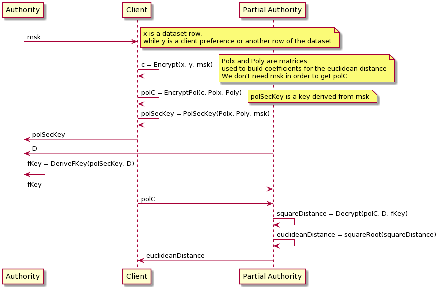

# string equalty test
This project aims at developing a recommender system that expoloits the euclidean distance for computing similarity between a client preference and the elements of the dataset, or between two elements of the dataset.
Elements and preference are represented as vectors and are encrypted using functional encryption by the client. Then a partial trusted authority will compute the euclidean distance between the encrypted vectors without knowing anything about the original vectors. Finally it sends back the result to the client.
The adopted schema is the same used for the classification task, the quadratic polynomial [SGP](https://eprint.iacr.org/2018/206.pdf), since we have to compute the euclidean distance.

## Diagram

 

## Files
- create_polys_and_D_matrix.py: given two vectors of chars, stores the corresponding polX, polY and the matrix D in the data directory. This is just a workaround, this part will be done directly in go. 
- main.go: includes the operations for generating keys, encrypting vectors and decrypting: if the result of decryption is true, this means that the distance among the vectors of chars is zero, therefore they are equal.   

## ISSUES
- Verify who has to send the plain matrix D to the authority for computing the fKey.
- Do the same task with inner product    

