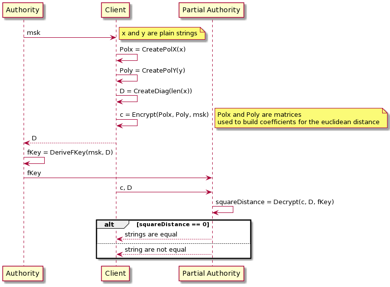

# string equalty test with functional encryption
This project develops a string equalty test using the euclidean distance between the strings.
Strings are represented as vectors and they are encrypted using functional encryption by a client. Then a partial trusted authority will compute the euclidean distance between the encrypted vectors without knowing anything about the original vectors. Finally it sends back the result to the client.
The adopted schema is the quadratic polynomial [SGP](https://eprint.iacr.org/2018/206.pdf), since we have to compute the euclidean distance. Functional encryption library used is [gofe](https://github.com/fentec-project/gofe).

## Diagram

 

## Files
- create_polys_and_D_matrix.py: given two vectors of chars, stores the corresponding polX, polY and the matrix D in the data directory. This is just a workaround, this part will be done directly in go. 
- main.go: includes the operations for generating keys, encrypting vectors and decrypting: if the result of decryption is true, this means that the distance among the vectors of chars is zero, therefore they are equal.   

## ISSUES
- Verify who has to send the plain matrix D to the authority for computing the fKey.
- Note: a same task could be done with inner product using a vector containing polynomial coefficients and another containing the terms of the two strings     

